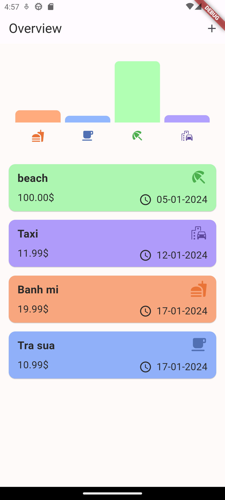
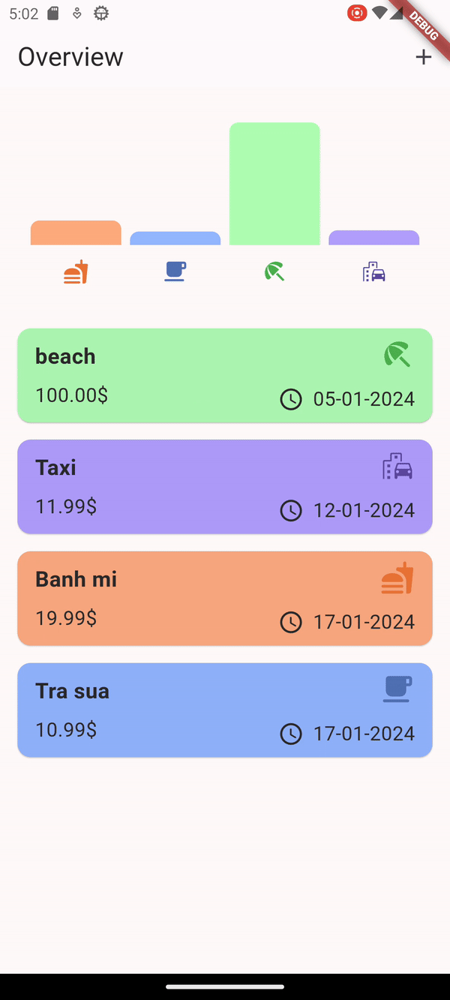
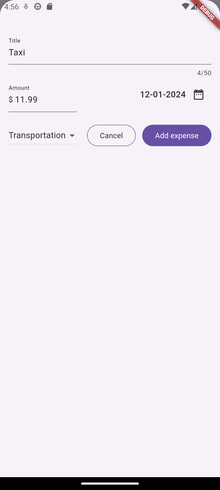

# expanse_tracker

## :building_construction: Tech Stack
- Kotlin
- MongoDB
- Firebase Storage
- GCP (APIs & Services)

### Feature
- Add/Remove Expense
- Chart of all expenses

## :camera_flash: **Screenshots**
### Home Screen

### Add Screen

